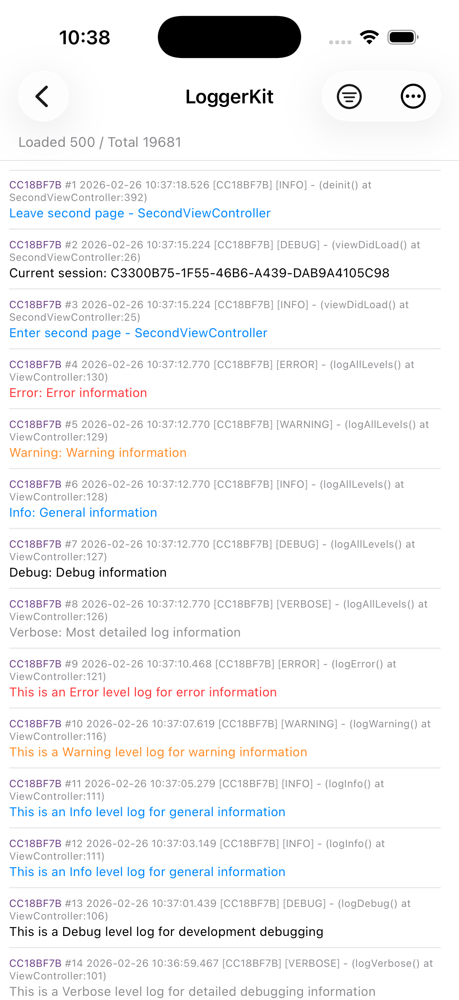
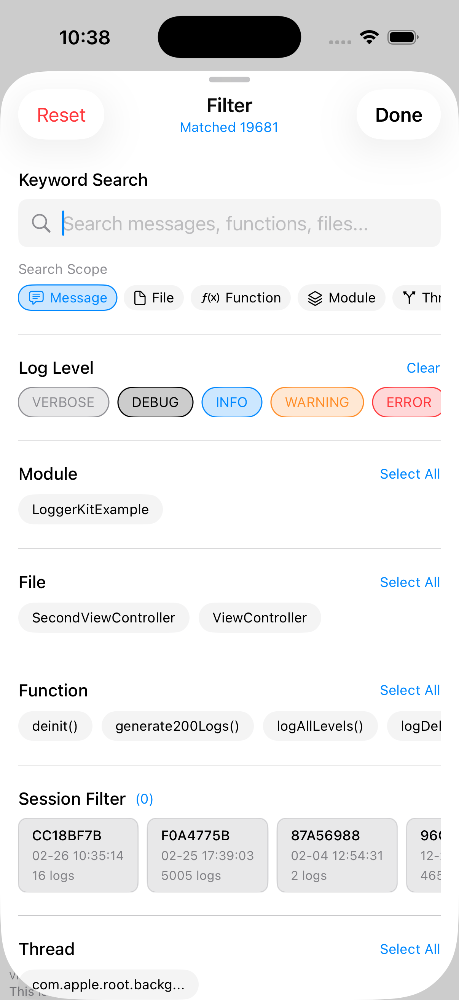
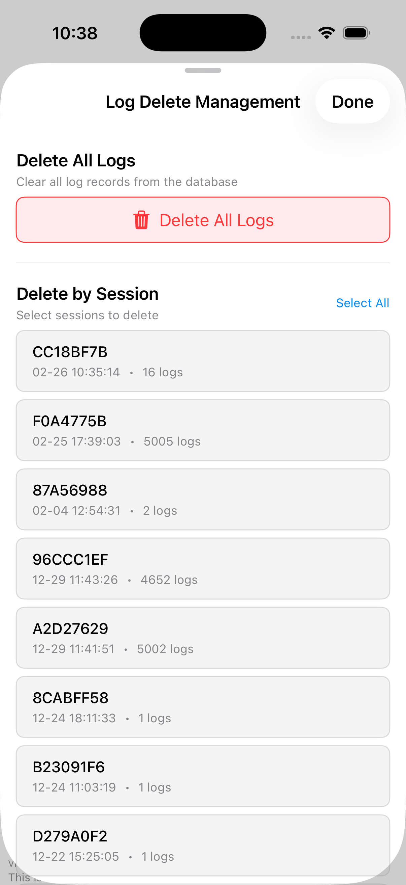
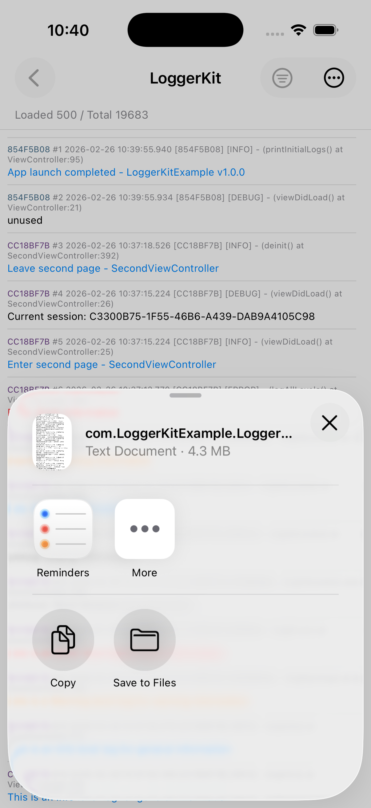

# LoggerKit

[](https://github.com/HeminWon/LoggerKit/actions/workflows/swift.yml)
[](https://cocoapods.org/pods/HMLoggerKit)
[](https://swiftpackageindex.com/HeminWon/LoggerKit)
[](https://swiftpackageindex.com/HeminWon/LoggerKit)

A high-performance logging framework for Apple platforms built on SwiftyBeaver. Lightweight `Logger` instances share a single engine with CoreData-backed persistence, rotation policies, and built-in SwiftUI/UIKit log viewers.

## Table of Contents

- [Features](#features)
- [Compatibility and Installation](#compatibility-and-installation)
- [Quick Start](#quick-start)
- [Advanced Configuration](#advanced-configuration)
- [Log Viewer UI](#log-viewer-ui)
- [SwiftUI Environment](#swiftui-environment)
- [Testing](#testing)
- [Example App](#example-app)
- [Screenshots](#screenshots)
- [FAQ](#faq)
- [Open Source Collaboration](#open-source-collaboration)
- [License](#license)

## Features

- Lightweight `Logger` value type with shared engine across instances
- CoreData-backed persistence with size and retention-based rotation
- Console output and database storage can be enabled independently
- Async batched writes with debounce and immediate flush for critical levels
- Automatic context extraction (module name) or custom context
- SwiftUI `Environment` integration
- Built-in log viewer with filtering, search, and export

## Compatibility and Installation

### Requirements

- Swift 5.9+
- iOS 15+
- macOS 12+
- watchOS 8+
- tvOS 15+

### Installation Matrix

| Package Manager | Supported Platforms |
| --- | --- |
| Swift Package Manager | iOS / macOS / watchOS / tvOS |
| CocoaPods (`HMLoggerKit`) | iOS / macOS / watchOS / tvOS |

### Swift Package Manager

```swift
dependencies: [
    .package(url: "https://github.com/HeminWon/LoggerKit.git", from: "0.2.6")
]
```

```swift
.target(
    name: "YourTarget",
    dependencies: ["LoggerKit"]
)
```

### CocoaPods

```ruby
pod 'HMLoggerKit', '~> 0.2.6'
```

## Quick Start

> Important: call `LK.configure(...)` early during app launch.

### SwiftUI

```swift
import SwiftUI
import LoggerKit

@main
struct MyApp: App {
    init() {
        LK.configure(level: .debug, enableConsole: true, enableDatabase: true)
    }

    var body: some Scene {
        WindowGroup { ContentView() }
    }
}
```

### UIKit

```swift
import UIKit
import LoggerKit

@main
class AppDelegate: UIResponder, UIApplicationDelegate {
    func application(
        _ application: UIApplication,
        didFinishLaunchingWithOptions launchOptions: [UIApplication.LaunchOptionsKey: Any]?
    ) -> Bool {
        LK.configure(level: .debug, enableConsole: true, enableDatabase: true)
        return true
    }
}
```

### Logging

```swift
import LoggerKit

let logger = Logger()
logger.debug("Debug message")
logger.info("Info message")
logger.warning("Warning message")
logger.error("Error message")
```

## Advanced Configuration

Use `LK.configure(...)` for most cases. Use `LoggerEngine.configure(...)` only when you need fine-grained write behavior control:

```swift
import LoggerKit

LoggerEngine.configure(
    LoggerEngineConfiguration(
        level: .info,
        enableConsole: true,
        enableDatabase: true,
        maxDatabaseSize: 100 * 1024 * 1024,
        maxRetentionDays: 30,
        batchSize: 50,
        debounceInterval: 2.0,
        immediateFlushLevels: [.error, .warning]
    )
)
```

## Log Viewer UI

### SwiftUI

```swift
import SwiftUI
import LoggerKit

struct LogsView: View {
    var body: some View {
        LK.makeViewWithViewStore()
    }
}
```

### UIKit

```swift
import UIKit
import LoggerKit

final class HomeViewController: UIViewController {
    @objc private func showLogs() {
        let vc = LK.makeViewController()
        navigationController?.pushViewController(vc, animated: true)
    }
}
```

## SwiftUI Environment

```swift
import SwiftUI
import LoggerKit

struct MyView: View {
    @Environment(\.logger) private var logger

    var body: some View {
        Button("Log") { logger.info("Button tapped") }
    }
}
```

## Testing

`MockLogger` is available in `Sources/LoggerKit/Testing` for unit tests and logging behavior assertions.

## Example App

See `Examples/iOS/LoggerKitExample` for a full demo.

## Screenshots

<p align="left">
  
  
  
  
  
</p>

## FAQ

### 1) Why are logs not visible?

- Confirm `LK.configure(...)` is called during app startup
- Confirm the configured log level allows the log you are writing (for example `.info` does not include `.debug`)
- If only database output is enabled, logs will not appear in the Xcode console

### 2) What happens if configure is called twice?

`LoggerEngine` can be configured only once. Additional calls are ignored (and trigger `assertionFailure` in DEBUG).

### 3) Where are logs stored?

Logs are stored and managed through CoreData. Use the built-in log viewer for browsing and export instead of relying on fixed file paths.

### 4) Do I need to manually run cleanup/rotation?

Usually no. Rotation checks are executed asynchronously after startup.

## Open Source Collaboration

- Contributing guide: `CONTRIBUTING.md`
- Security policy: `SECURITY.md`
- Code of conduct: `CODE_OF_CONDUCT.md`
- Changelog: `CHANGELOG.md`

## License

MIT
